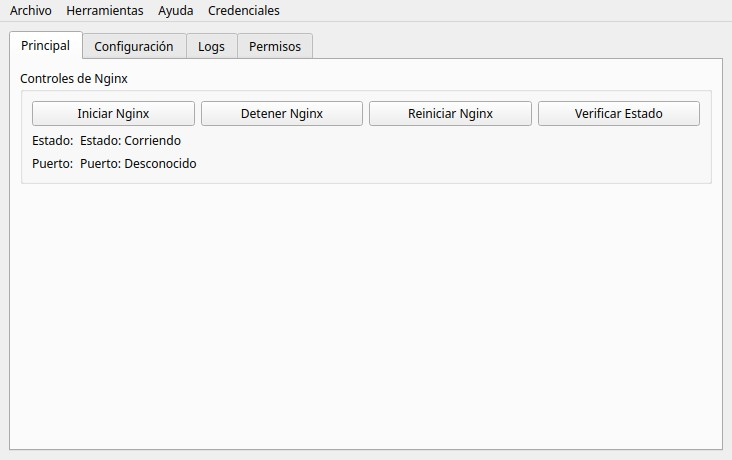

[ESPAÑOL](README_ES.md) | [ENGLISH](README.md)

# Pyginx - Nginx GUI Manager

## Description

Pyginx is a graphical user interface for managing Nginx servers on Linux. It provides an easy-to-use interface that allows users to control the Nginx server, view logs, edit configurations, and manage file permissions.

## Features

- Start, stop, and restart Nginx server
- Check server status and listening ports
- Real-time log viewer with follow functionality
- Configuration editor with profile support
- Configuration testing and backup creation
- File permission verification and correction tools
- Secure root password storage with obfuscation
- Detailed logging system

## Installation

1. Clone or download the repository
2. Run the script with Python 3: `python3 pyginx_manager.py`
3. The application will automatically create a virtual environment and install required dependencies

## Usage

1. Run the script: `python3 pyginx_manager.py`
2. The application provides four main tabs:
   - **Main**: Control Nginx (start/stop/restart/status)
   - **Configuration**: Edit configuration files and manage profiles
   - **Logs**: View access and error logs in real-time
   - **Permissions**: Check and fix file permissions

## Requirements

- Linux operating system
- Python 3.x
- Nginx installed on the system
- Root privileges for certain operations

## Documentation Files

- [README in Spanish](README_ES.md)
- [Instructions for Qwen CLI](QWEN.md)
- [Conversation summary](.chat_log/resumen_conversacion.md)

## License

This project is created for educational purposes and personal use.
